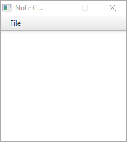
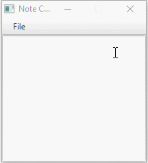

# Notes
A small JavaFX program for making a quick note. 

## Usage

After downloading the latest release, open the Notes app by double clicking on Notes.jar.

You will then see the following UI:

Enter whatever text you need to remember. The text will wrap, and will become scrollable as the note gains length:

The note will remain on top of all of your windows, unless you minimize it.

If you want a second note, select File -> New Note. Your original will be retained and a new Note will be created.
